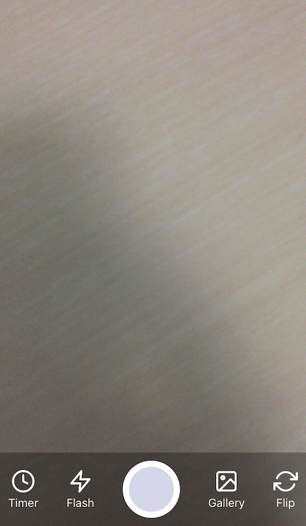

<h2 align="center">React Native Fast Camera</h2>
<p align="center">The most needed high-quality native camera for <a href="https://facebook.github.io/react-native/">react native.</a> A fast native camera controllable by react native components.

<p align="center">
  <a href="./example.js">Full Example</a>
</p>

<p align="center">
  
</p>

## Motivation
I was looking for a flexible and fast camera component for react native, tried [react-native-camera](https://github.com/react-native-community/react-native-camera) and [react-native-camera-kit](https://github.com/wix/react-native-camera-kit) but was not satisfied with the performance. In a nutshell, this module is the product of months of research and experimentations with an aim to create a useful solution.

## Getting Started

### 1. Installation
   * with yarn: `yarn add react-native-fast-camera`
   * with npm: `npm install --save react-native-fast-camera`

### 2. Linking
   * 1. Copy `ios/FastCamera` folder to your `ios` folder.
   * 2. from Xcode Project navigator select `Add Files to "project name"` then select `ios/FastCamera`.

### 3. Permissions
Add the following permission strings to your `info.plist` file, update the messages according to your needs. Otherwise your app will crash.
```
<key>NSCameraUsageDescription</key>
<string>We need to access your camera to take pictures.</string>
<key>NSPhotoLibraryAddUsageDescription</key>
<string>We need to access your photo library to save the captured pictures.</string>
```

## Usage

```JSX
  import FastCamera, { Methods } from 'react-native-fast-camera';
```

```JSX
  <FastCamera style={{ height: cameraHeight, width: cameraWidth }}
    onSaveSuccess={imageUrl => {
      console.log("onSaveSuccess: ", imageUrl);
    }}
    onGalleryImage={imageUrl => {
      console.log("onGalleryImage: ", imageUrl);
    }}
    onFlashToggle={isflashOn => {
      console.log('flash info: ', isflashOn);
    }}
  >
    {/* here render your buttons to control the camera component */}
  </FastCamera>
```

## API
| Property |      Type      |  Description  |
|----------|:-------------:|----------|
| onSaveSuccess | Callback | a callback triggered when the image was captured and saved successfully |
| onGalleryImage | Callback | a callback triggered when the image was selected from the user photo library |
| onFlashToggle | Callback | a callback triggered when the flash status change |
| timer | Method | `Methods.timer()` a method to show timer UI |
| toggleFlash | Method | `Methods.toggleFlash()` a method to toggle flash mode |
| takePicture | Method | `Methods.takePicture()` a method to capture a picture |
| pickImage | Method | `Methods.pickImage()` a method to pick an image from the photo library |
| flipCamera | Method | `Methods.flipCamera()` a method to flip the camera face (front/back) |

## TODO
- [x] Take a picture.
- [x] Pick an image from photo library.
- [x] Flip camera.
- [x] Flash On/Off mode.
- [x] Add timer.
- [ ] **Add Android support**.
- [ ] Add prop to set camera default face (front/back).
- [ ] Export the iOS component as a pod module.

## ACKNOWLEDGEMENTS
- [EVNCamera](https://github.com/zonghongyan/EVNCamera), used as the base for iOS part.
